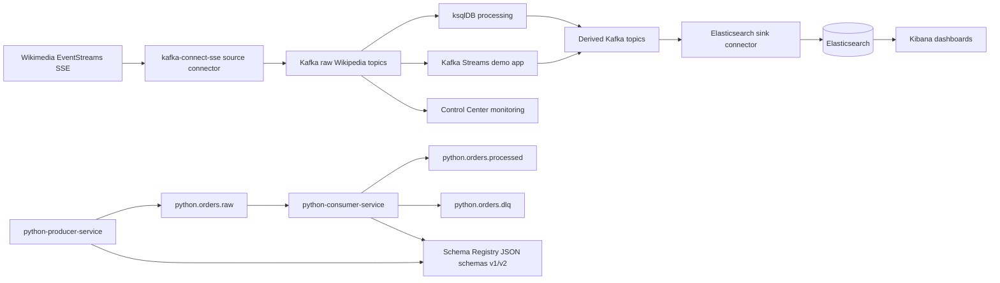

# Kafka Pipeline Map

## cp-demo flow

- Source: Wikimedia EventStreams, real-time page edits.
- Ingest: Kafka Connect SSE source connector reads the SSE stream.
- Processing: ksqlDB and the bundled Kafka Streams application derive enriched/aggregated topics.
- Sink: Kafka Connect Elasticsearch sink connector materializes processed data.
- Visualization: Kibana reads the Elasticsearch indices; Control Center shows Kafka/Connect/ksqlDB health and topics.

## Python flow

- `python-producer-service` writes JSON events to `python.orders.raw`.
- Message key is `user_id`, so equal users are routed to the same partition.
- `python-consumer-service` manually commits offsets only after validation, processing, idempotency marking, or DLQ publication.
- Valid events become `python.orders.processed`.
- Invalid or permanently failed events go to `python.orders.dlq` with an explicit `reason`.
